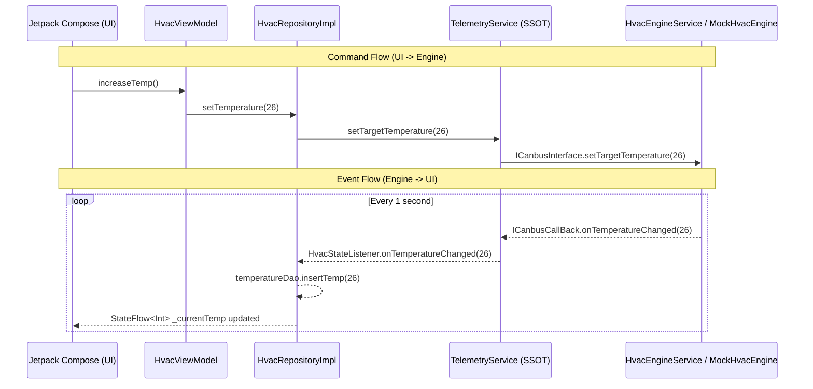

# Smart Vehicle Telemetry Dashboard — Mobile

A Jetpack Compose Android application simulating a real-time vehicle telemetry dashboard. The app demonstrates bidirectional IPC via Android AIDL, a Foreground Service architecture, Room Database persistence, and Clean Architecture principles.

---

## Branch Structure

| Branch | Description |
|---|---|
| `main` | Stable base project |
| `feature/hvac-engine-service` | MVP — HVAC control + Telemetry UI, each subsystem manages its own AIDL connection independently |
| `feature/ssot-architecture` | Refactored — `TelemetryService` acts as the Single Source of Truth (SSOT), centralizing all AIDL connections |

---

## Architecture Overview

### MVP Architecture (`feature/hvac-engine-service`)

Each subsystem (HVAC, Telemetry) manages its own Service binding independently.

```
HvacViewModel         TelemetryViewModel
     |                       |
HvacRepositoryImpl    TelemetryRepositoryImpl
     |                       |
  (AIDL)               (LocalBinder)
     |                       |
HvacEngineService     TelemetryService
                        (Speed/Battery Simulator)
```

### SSOT Architecture (`feature/ssot-architecture`)

`TelemetryService` is the central hub that owns all hardware connections. Repositories communicate with it via `LocalBinder`.

```
HvacViewModel         TelemetryViewModel
     |                       |
HvacRepositoryImpl    TelemetryRepositoryImpl
     |    (LocalBinder)      |    (LocalBinder)
     +----------+------------+
                |
        TelemetryService   <-- Single Source of Truth (Foreground Service)
         |           |
      (AIDL)   Speed/Battery
         |       Simulator
   HvacEngineService
    (MockHvacEngine)
```

---

## Data Flow (SSOT Branch)



---

## Component Responsibilities

### Presentation Layer
- **`HvacScreen`**: Compose UI — observes `StateFlow`, renders HVAC controls. Prevents temp adjustment when HVAC is off.
- **`HvacViewModel`**: Bridges UI actions to `HvacRepository`. Guards min/max temperature (`HvacConfig`).
- **`TelemetryScreen`**: Displays real-time Speed and Battery with smooth `animateFloatAsState` animations.
- **`DashboardScreen`**: Root screen composing all widgets. Includes a Power Off button to cleanly shut down all services.

### Data Layer
- **`HvacRepositoryImpl`** *(SSOT branch)*: Binds to `TelemetryService` via `LocalBinder`. Delegates all HVAC commands to the service. Receives state updates via `HvacStateListener`. Persists temperature to Room DB on every change.
- **`TelemetryRepositoryImpl`**: Binds to `TelemetryService` via `LocalBinder`. Receives Speed/Battery updates via `TelemetryListener`.
- **`TemperatureDao`**: Room DAO for persisting and restoring temperature across app restarts.

### Service Layer
- **`TelemetryService`** *(SSOT branch)*: Foreground Service acting as the SSOT hub. Manages the AIDL connection to `HvacEngineService`, runs the Speed/Battery simulator, and exposes `LocalBinder` + Listener interfaces for repositories.
- **`HvacEngineService`**: AIDL Server implementing `ICanbusInterface`. Delegates to `MockHvacEngine` running on a `HandlerThread` to prevent blocking.
- **`MockHvacEngine`**: Pure Java simulation engine. Runs an infinite loop, gradually adjusting temperature toward the target value every second.

### IPC Layer (AIDL)
- **`ICanbusInterface.aidl`**: Client-to-Server commands (`setHvacEnabled`, `setTargetTemperature`, `registerCallBack`).
- **`ICanbusCallBack.aidl`**: Server-to-Client events (`onTemperatureChanged`, `onTurnHvacEngine`).

---

## Database Persistence Strategy

Temperature is persisted with a 3-layer anti-data-loss strategy:

| Trigger | Action |
|---|---|
| `onTemperatureChanged` callback | Save to DB immediately on every engine update |
| `onHvacStateChanged(false)` callback | Snapshot to DB when HVAC turns off |
| `unbindService()` | Final snapshot to DB before app exits |
| App restart (`onServiceConnected`) | Read last saved temp from DB and restore to engine |

---

## Tech Stack

- **Language**: Kotlin + Java (AIDL Services)
- **UI**: Jetpack Compose + Material 3
- **Architecture**: Clean Architecture (Presentation → Domain → Data)
- **DI**: Hilt
- **Async**: Kotlin Coroutines + StateFlow
- **Database**: Room (local persistence)
- **IPC**: Android AIDL (bidirectional)
- **Background**: Foreground Service with Ongoing Notification
