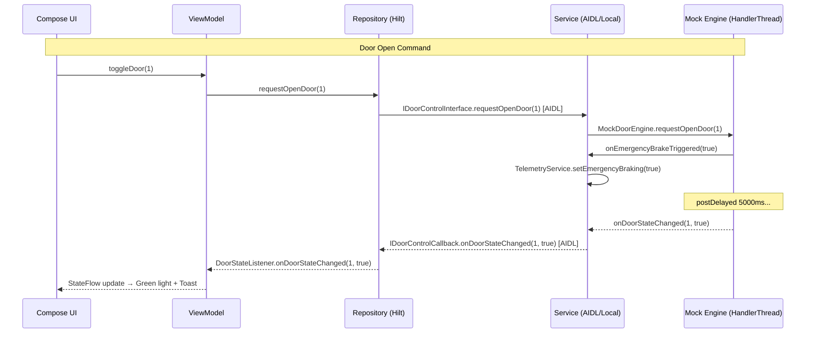

# Smart Vehicle Telemetry Dashboard — Mobile

A **Jetpack Compose** Android application simulating a real-time, luxury in-vehicle infotainment system. The app demonstrates bidirectional IPC via Android AIDL, a Foreground Service architecture, Room Database persistence, WorkManager background sync, and **Clean Architecture** principles across 4 independent subsystems: **Telemetry**, **HVAC**, **Door Control**, and **Weather**.

---

## ✨ Features

| Feature | Description |
|---|---|
| 🚗 **Real-time Telemetry** | Live speed (0–120 km/h) and battery level simulation with animated gauges |
| ❄️ **HVAC Control** | Bidirectional AIDL — set target temperature, receive current temp callback |
| 🚪 **Door Control** | Open/close 4 doors with a 5-second emergency brake delay before opening |
| 🌤️ **Weather Sync** | Periodic background weather fetch via WorkManager, cached in Room DB |
| ✨ **Luxury Startup** | Premium splash screen with dynamic boot sequence and seamless Android 12+ transitions |
| 🌐 **Professional Standard** | 100% English UI and codebase, strictly following modern Android best practices |
| 🔔 **Toast Notifications** | Real-time door open/close and weather sync alerts |

---

## Branch Structure

| Branch | Description |
|---|---|
| `main` | Stable base project |
| `feature/hvac-engine-service` | MVP — HVAC + Telemetry, each subsystem manages its own AIDL independently |
| `feature/ssot-architecture` | SSOT refactor — `TelemetryService` centralises all connections |
| `feature/weather-sync` | Weather module — WorkManager + Room DB + OpenWeatherMap API |
| `feature/door-control-aidl` | Door Control — AIDL + Emergency Braking + Compose UI |
| `feat/temperature-and-dashboard` | Final integration branch — combines all subsystems, splash redesign, and localization |

---

## Architecture Overview

The project follows **Clean Architecture** with a strict separation of 3 layers:

```text
┌─────────────────────────────────────────────┐
│              Presentation Layer              │
│   DashboardScreen, HvacScreen,              │
│   TelemetryScreen, DoorScreen, WeatherWidget │
│   SplashScreen, ViewModel (StateFlow)        │
└──────────────────┬──────────────────────────┘
                   │ depends on
┌──────────────────▼──────────────────────────┐
│               Data Layer                     │
│  Repository Impl (Hilt @Singleton)           │
│  Room DAO / Retrofit API / AIDL Binder       │
│  WorkManager Worker                          │
└──────────────────┬──────────────────────────┘
                   │ depends on
┌──────────────────▼──────────────────────────┐
│              Domain / Engine Layer           │
│  Listener Interfaces (Java)                  │
│  Mock Engines (HandlerThread simulation)     │
│  AIDL .aidl files (IPC contracts)            │
└─────────────────────────────────────────────┘
```

---

## Full Project Structure

```text
app/src/main/
├── aidl/
│   └── com/dantruong/.../
│       ├── ICanbusInterface.aidl        # HVAC commands (Client → Server)
│       ├── ICanbusCallBack.aidl         # HVAC events   (Server → Client)
│       ├── IDoorControlInterface.aidl   # Door commands (Client → Server)
│       └── IDoorControlCallback.aidl   # Door events   (Server → Client)
│
├── java/com/dantruong/.../
│   ├── data/
│   │   ├── local/
│   │   │   ├── AppDatabase.kt          # Room database (Temperature, Weather tables)
│   │   │   ├── dao/
│   │   │   │   ├── TemperatureDao.kt
│   │   │   │   └── WeatherDao.kt
│   │   │   └── entity/
│   │   │       ├── Temperature.kt
│   │   │       └── WeatherEntity.kt
│   │   ├── remote/
│   │   │   ├── WeatherApiService.kt    # Retrofit interface
│   │   │   └── model/WeatherResponse.kt
│   │   ├── repository/
│   │   │   ├── HvacRepositoryImpl.kt
│   │   │   ├── TelemetryRepositoryImpl.kt
│   │   │   ├── DoorRepositoryImpl.kt
│   │   │   └── WeatherRepositoryImpl.kt
│   │   └── worker/
│   │       └── WeatherSyncWorker.kt    # HiltWorker — periodic weather fetch
│   │
│   ├── di/
│   │   ├── DatabaseModule.kt           # Room DB + DAO providers
│   │   ├── NetworkModule.kt            # Retrofit + OkHttp providers
│   │   └── RepositoryModule.kt         # @Binds all Repository interfaces
│   │
│   ├── domain/
│   │   ├── engine/
│   │   │   ├── MockHvacEngine.java     # HVAC simulation (HandlerThread)
│   │   │   ├── MockDoorEngine.java     # Door simulation (HandlerThread)
│   │   │   ├── HvacEngineListener.java # Engine → Service callback
│   │   │   ├── DoorEngineListener.java # Engine → Service callback
│   │   │   ├── HvacStateListener.java  # Service → Repository callback
│   │   │   └── DoorStateListener.java  # Service → Repository callback
│   │   └── model/
│   │       ├── TelemetryData.kt
│   │       └── WeatherData.kt
│   │
│   ├── framework/
│   │   └── services/
│   │       ├── TelemetryService.java   # Foreground Service + speed/battery loop
│   │       ├── HvacEngineService.java  # AIDL Server for HVAC
│   │       └── DoorControlService.java # AIDL Server for Door Control
│   │
│   └── presentation/
│       ├── splash/
│       │   ├── SplashScreen.kt         # Luxury startup sequence
│       │   └── SplashViewModel.kt
│       ├── dashboard/DashboardScreen.kt
│       ├── telemetry/
│       │   ├── TelemetryScreen.kt
│       │   └── TelemetryViewModel.kt
│       ├── hvac/
│       │   ├── HvacScreen.kt
│       │   └── HvacViewModel.kt
│       ├── door/
│       │   ├── DoorScreen.kt
│       │   └── DoorViewModel.kt
│       └── weather/
│           ├── WeatherWidget.kt
│           └── WeatherViewModel.kt
```

---

## Subsystem Deep Dives

### 1. 🚗 Telemetry — Speed & Battery Simulator

`TelemetryService` is a **Foreground Service** that runs a background thread simulating vehicle telemetry. It also acts as the hub for HVAC and Door Control services.

```java
// TelemetryService.java — Emergency Braking integration
private volatile boolean isEmergencyBraking = false;

public void setEmergencyBraking(boolean emergencyBraking) {
    this.isEmergencyBraking = emergencyBraking;
}

// Speed simulation loop:
while (isRunning) {
    if (isEmergencyBraking) {
        // When door open command received: force speed to 0
        if (speed > 0) speed -= 10;
        if (speed < 0) speed = 0;
    } else {
        // Normal drive simulation
        if (isAccelerating) speed += 2; else speed -= 1;
        if (speed >= 120) isAccelerating = false;
        if (speed <= 0)   isAccelerating = true;
    }
    telemetryListener.onTelemetryUpdated(new TelemetryData(speed, battery));
    Thread.sleep(200);
}
```

---

### 2. ❄️ HVAC — Bidirectional AIDL

The HVAC system uses two AIDL files to enable **bidirectional communication** between the app and the mock engine service.

**AIDL Contracts:**
```java
// ICanbusInterface.aidl — commands the engine
interface ICanbusInterface {
    void setHvacEnabled(boolean enabled);
    void setTargetTemperature(int temperature);
    int  getCurrentTemperature();
    boolean isHvacEnabled();
    void registerCallBack(ICanbusCallBack callback);
    void unregisterCallBack(ICanbusCallBack callback);
}

// ICanbusCallBack.aidl — engine reports back to app
interface ICanbusCallBack {
    void onTemperatureChanged(int temperature);
    void onTurnHvacEngine(boolean isOn);
}
```

**3-Layer Architecture:**
```text
MockHvacEngine (HandlerThread)
    │ HvacEngineListener (Java interface)
    ▼
HvacEngineService (AIDL Server + IPC HandlerThread)
    │ ICanbusCallBack (AIDL)
    ▼
TelemetryService (SSOT — LocalBinder)
    │ HvacStateListener (Java interface)
    ▼
HvacRepositoryImpl → TemperatureDao (Room DB)
    │ StateFlow<Int>
    ▼
HvacViewModel → HvacScreen (Compose UI)
```

**Temperature persistence with 3 safety checkpoints:**

| Trigger | Action |
|---|---|
| `onTemperatureChanged()` callback | Save to Room DB immediately |
| `onHvacStateChanged(false)` | Snapshot to DB when HVAC turns off |
| `unbindService()` | Final snapshot before app exits |
| App restart `onServiceConnected` | Restore last saved temp from DB |

---

### 3. 🚪 Door Control — AIDL + Emergency Braking

The Door Control system is the most complex module. It uses a **3-layer architecture** (Engine → Service → Repository) identical to HVAC, with the added safety requirement that **the vehicle must stop before any door can open**.

**AIDL Contracts:**
```java
// IDoorControlInterface.aidl — commands
interface IDoorControlInterface {
    void requestOpenDoor(int doorId);
    void requestCloseDoor(int doorId);
    boolean isDoorOpen(int doorId);
    void registerCallback(IDoorControlCallback callback);
    void unregisterCallback(IDoorControlCallback callback);
}

// IDoorControlCallback.aidl — events
interface IDoorControlCallback {
    void onDoorStateChanged(int doorId, boolean isOpen);
    void onDoorError(int doorId, int errorCode);
}
```

**Data Flow:**
```text
[User taps "Door 1"]
        │
DoorViewModel.toggleDoor(1)
        │
DoorRepositoryImpl.requestOpenDoor(1)  ← Hilt @Singleton
        │ AIDL
        ▼
DoorControlService.requestOpenDoor(1)
        │ calls
        ▼
MockDoorEngine.requestOpenDoor(1)
        ├── DoorEngineListener.onEmergencyBrakeTriggered(true)
        │       └─→ TelemetryService.setEmergencyBraking(true)
        │                └─→ Speed loop ──→ speed -= 10 every 200ms
        │
        └── handler.postDelayed(5000ms) ← runs on DoorEngineThread (background)
                │
                ▼ (after 5 seconds)
        DoorEngineListener.onDoorStateChanged(1, true)
                │ IPC (DoorIpcHandlerThread)
                ▼
        IDoorControlCallback.onDoorStateChanged(1, true)
                │ AIDL → DoorRepositoryImpl
                ▼
        DoorStateListener.onDoorStateChanged(1, true)
                │
        DoorViewModel._doorStates updated
                │
        DoorScreen: Button turns GREEN 🟢
        Toast: "Door 1 is now OPEN"
```

**MockDoorEngine — background thread safety:**
```java
public class MockDoorEngine {
    private final HandlerThread engineThread; // Dedicated background thread
    private final Handler handler;

    public MockDoorEngine() {
        engineThread = new HandlerThread("DoorEngineThread");
        engineThread.start();
        handler = new Handler(engineThread.getLooper());
    }

    public void requestOpenDoor(int doorId) {
        if (Boolean.TRUE.equals(doorStates.get(doorId))) return;

        // Step 1: Trigger emergency braking immediately
        if (listener != null) listener.onEmergencyBrakeTriggered(true);

        // Step 2: Wait 5 seconds for vehicle to stop, then open door
        handler.postDelayed(() -> {
            doorStates.put(doorId, true);
            if (listener != null) listener.onDoorStateChanged(doorId, true);
        }, 5000);
    }

    public void destroy() {
        engineThread.quit(); // Clean up thread on service destroy
    }
}
```

**DoorControlService — anti-deadlock IPC thread:**
```java
// DoorControlService uses a DEDICATED IPC thread to avoid blocking MockDoorEngine
// when the remote callback (client process) is slow or lagging.
ipcHandlerThread = new HandlerThread("DoorIpcHandlerThread");
ipcHandlerThread.start();
ipcHandler = new Handler(ipcHandlerThread.getLooper());

mockDoorEngine.setListener(new DoorEngineListener() {
    @Override
    public void onDoorStateChanged(int doorId, boolean isOpen) {
        // Push IPC call to dedicated thread — never blocks the engine thread
        ipcHandler.post(() -> {
            for (IDoorControlCallback callback : callbacks) {
                try { callback.onDoorStateChanged(doorId, isOpen); }
                catch (RemoteException e) { callbacks.remove(callback); }
            }
        });
    }
    @Override
    public void onEmergencyBrakeTriggered(boolean isBraking) {
        if (isBound && telemetryService != null)
            telemetryService.setEmergencyBraking(isBraking);
    }
});
```

**DoorViewModel — StateFlow state management:**
```kotlin
@HiltViewModel
class DoorViewModel @Inject constructor(
    private val doorRepository: DoorRepository
) : ViewModel(), DoorStateListener {

    private val _doorStates = MutableStateFlow<Map<Int, Boolean>>(emptyMap())
    val doorStates: StateFlow<Map<Int, Boolean>> = _doorStates.asStateFlow()

    // Pending = spinning indicator shown while 5-second delay runs
    private val _doorPendingStates = MutableStateFlow<Map<Int, Boolean>>(emptyMap())
    val doorPendingStates: StateFlow<Map<Int, Boolean>> = _doorPendingStates.asStateFlow()

    // One-shot event for Toast notification
    private val _doorEvent = MutableStateFlow<DoorEvent?>(null)
    val doorEvent: StateFlow<DoorEvent?> = _doorEvent.asStateFlow()

    override fun onDoorStateChanged(doorId: Int, isOpen: Boolean) {
        _doorStates.update { it.toMutableMap().apply { put(doorId, isOpen) } }
        _doorPendingStates.update { it.toMutableMap().apply { remove(doorId) } }
        _doorEvent.value = DoorEvent(
            if (isOpen) "Door $doorId is now OPEN" else "Door $doorId is now CLOSED"
        )
    }
}
```

---

### 4. 🌤️ Weather — WorkManager + Room DB

Weather data is fetched periodically via WorkManager and cached in Room DB. The UI reads directly from the DB, ensuring data survives offline periods.

**WorkManager setup (every 15 minutes):**
```kotlin
// ApplicationContext.kt
val weatherRequest = PeriodicWorkRequestBuilder<WeatherSyncWorker>(
    15, TimeUnit.MINUTES
).build()

WorkManager.getInstance(this).enqueueUniquePeriodicWork(
    "WeatherSync",
    ExistingPeriodicWorkPolicy.KEEP,
    weatherRequest
)
```

**Data flow:**
```text
WorkManager (every 15 min)
    │ WeatherSyncWorker.doWork()
    ▼
Retrofit → OpenWeatherMap API
    │ WeatherRepositoryImpl.getWeatherData()
    ▼
Room DB → WeatherDao.insertWeather()
    │ WeatherDao.getLatestWeather() [Flow]
    ▼
WeatherViewModel → WeatherWidget (Compose)
```

---

## Data Flow Diagram (Full System)



---

## Thread Architecture

Each subsystem runs on its own dedicated thread to ensure **zero UI blocking**:

| Thread Name | Owner | Purpose |
|---|---|---|
| `main` | Android OS | UI rendering (60fps) |
| `TelemetrySimulatorThread` | `TelemetryService` | Speed/battery simulation loop |
| `DoorEngineThread` | `MockDoorEngine` | 5-second door countdown timer |
| `DoorIpcHandlerThread` | `DoorControlService` | Anti-deadlock AIDL dispatch |
| `hvacHandlerThread` | `HvacEngineService` | HVAC AIDL callback dispatch |
| `WorkManager thread pool` | Android WorkManager | Weather HTTP fetch |

---

## Tech Stack

| Technology | Usage |
|---|---|
| **Kotlin + Java** | Kotlin for all Compose/ViewModel/Repository code; Java for AIDL Services and Engine simulation |
| **Jetpack Compose + Material 3** | Fully declarative UI with `animateColorAsState`, `animateFloatAsState` |
| **Hilt** | Dependency injection across all layers |
| **Android AIDL** | Bidirectional IPC for HVAC and Door Control |
| **Foreground Service** | `TelemetryService` runs persistently with ongoing notification |
| **Room** | Local persistence for temperature history and weather cache |
| **WorkManager** | Periodic background weather sync (every 15 min) |
| **Retrofit + OkHttp** | Weather API integration (OpenWeatherMap) |
| **Kotlin Coroutines + StateFlow** | Async data flow from Repository to UI |
| **HandlerThread** | Dedicated background threads for each hardware engine |

---

## How to Run

1. Clone the repository
2. Open in **Android Studio Hedgehog** or later
3. Ensure **SDK 35** and **Build Tools 34** are installed
4. Sync Gradle dependencies
5. Run on an emulator or physical device (API 26+)

> **Note:** If you switch branches and encounter a Room schema crash (`IllegalStateException`), go to **Settings → Apps → Clear Data** on the device/emulator and re-launch.

---

## Highlights & Design Decisions

- **`CopyOnWriteArrayList` for callbacks** — Thread-safe list that prevents `ConcurrentModificationException` when a client disconnects while the service is iterating over callbacks.
- **Dedicated IPC Thread** — `DoorControlService` dispatches AIDL callbacks on a separate `HandlerThread`, preventing the engine simulation thread from being blocked by a slow client process.
- **`volatile` for emergency braking flag** — Ensures the flag set by `DoorControlService` is immediately visible to the simulator thread in `TelemetryService` without synchronization overhead.
- **SSOT Pattern** — `TelemetryService` owns all hardware connections, preventing multiple services from fighting over the same hardware resource.
