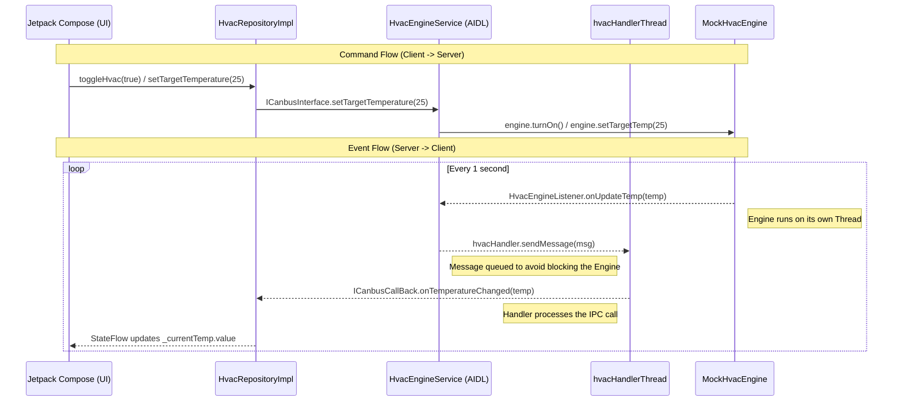

# HVAC Telemetry Architecture

## Overview
This document outlines the architecture and data flow of the HVAC (Heating, Ventilation, and Air Conditioning) background service. The system utilizes a Bi-directional Inter-Process Communication (IPC) model via Android AIDL to ensure smooth, non-blocking communication between the User Interface and the simulated vehicle engine running in a separate background thread.

## Architecture Data Flow



## Component Responsibilities

1. Client Layer (App Process)
- HvacScreen (Compose): Observes StateFlow and renders UI.
- HvacViewModel: Manages the lifecycle. Binds to the service on initialization and unbinds on clearance.
- HvacRepositoryImpl: Acts as the central hub. It initiates the `bindService` call, holds the `ICanbusInterface` to send commands, and provides the `ICanbusCallBack` to receive updates.

2. IPC Layer (AIDL)
- ICanbusInterface: The primary communication channel from the Repository to the Service.
- ICanbusCallBack: The reverse communication channel passed to the Service, allowing it to send real-time data back to the Repository.

3. Server Layer (Service Process)
- HvacEngineService: The Android Service that implements the AIDL stub. It holds the reference to the Client's callback.
- hvacHandlerThread: A dedicated background thread equipped with a Looper. It handles outgoing IPC calls to prevent the Engine loop from being blocked by potential network or process delays.
- MockHvacEngine: A simulated engine running an infinite loop on a raw Java Thread. It calculates temperature changes strictly every second.

## The Threading Model (Anti-Blocking Strategy)

The architecture deliberately separates the calculation thread from the communication thread. 
If the `MockHvacEngine` directly triggered the `ICanbusCallBack` to the Client, any delay in the IPC transaction would block the Engine's loop, causing inaccurate timing (e.g., updating every 1.5 seconds instead of 1.0 second). 
To solve this, the Engine delegates the IPC call to a `Handler` running on `hvacHandlerThread`. This allows the Engine to immediately return to its calculation loop while the Handler waits for the IPC transaction to complete.

## Sample Implementation

### 1. Client Binding and Callback Setup
```kotlin
// Inside HvacRepositoryImpl.kt
private val callback = object : ICanbusCallBack.Stub() {
    override fun onTemperatureChanged(temp: Int) {
        _currentTemp.value = temp
    }
}

private val serviceConnection = object : ServiceConnection {
    override fun onServiceConnected(name: ComponentName?, service: IBinder?) {
        hvacService = ICanbusInterface.Stub.asInterface(service)
        // Pass the callback to the service
        hvacService?.registerCallBack(callback)
    }
}
```

### 2. Service Handler Delegation
```java
// Inside HvacEngineService.java
hvacHandler = new Handler(hvacHandlerThread.getLooper(), msg -> {
    if (msg.what == MSG_TEMP_UPDATE) {
        int temp = msg.arg1;
        if (clientCallback != null) {
            try {
                // IPC call is executed on the Handler Thread, not the Engine Thread
                clientCallback.onTemperatureChanged(temp);
            } catch (RemoteException e) {
                e.printStackTrace();
            }
        }
    }
    return true;
});

// Engine simply drops a message into the Handler's queue
mockHvacEngine.setHvacEngineListener(new HvacEngineListener() {
    @Override
    public void onUpdateTemp(int temp) {
        Message msg = hvacHandler.obtainMessage(MSG_TEMP_UPDATE);
        msg.arg1 = temp;
        hvacHandler.sendMessage(msg);
    }
});
```
